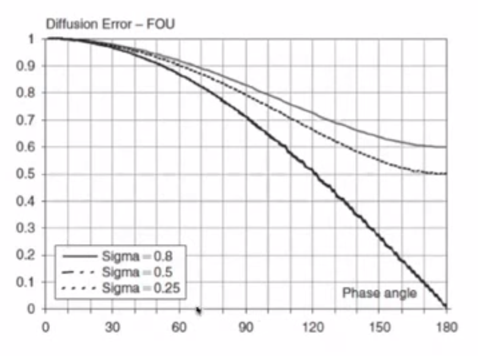
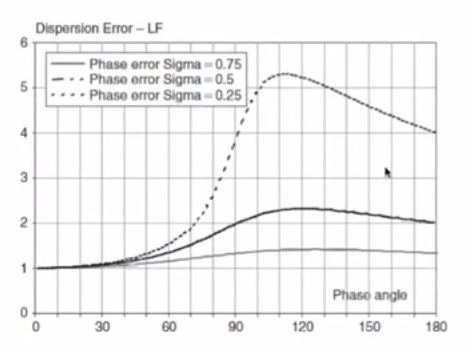
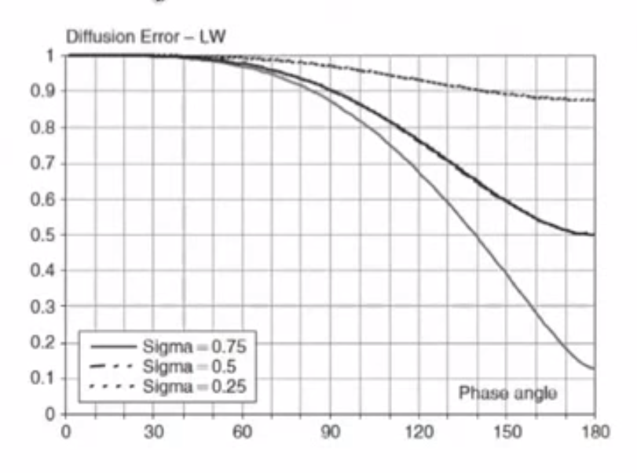

===========================
Spectral Analysis of Errors
===========================

.. contents::
   :local:

von Neumann Stability Analysis
==============================

* von Neumann stability analysis introduced a Fourier decomposition of the solution, defining an amplification factor, `G`, :math:`\Rightarrow` stability condition `G < 1`

* What else can we know about the errors?

 - Amplitude error :math:`\Rightarrow` numerical diffusion
 - Phase error :math:`\Rightarrow` numerical dispersion

We introduced a Fourier decomposision of the solution (where :math:`I = \sqrt{-1}`):

.. math:: u_i^n = \sum_{j=-N}^N V_j^n e^{Ik_j x_i} \qquad x_i = i \Delta x

A single harmonic is:

.. math:: (u_i^n)_k = V^n e^{I k i \Delta x}

We define an amplification factor:

.. math:: G = {{V^{n+1}} \over {V^n}}

A function of the scheme parameters and of the phase angle :math:`\phi` but not a function of :math:`n`

von Neumann stability condition:

.. math:: \left| G \right| \le 1 \qquad \forall \phi_j = k_j \Delta x

Amplitude and Phase Error
=========================

Now we want additional information on the error, in particular the time dependency of the:

* Amplitude :math:`V^n`
* Phase :math:`\phi`

Analytical Solution
-------------------

Consider the analytical solution of:

.. math:: u_t + cu_x = 0

Fourier decomposition - analytical solution is :math:`\tilde{u}`:

.. math:: \tilde{u}_i^n = \hat{V} e^{Ik(x_i-ct^n)}

Rewrite with :math:`c = {{\tilde{\omega}} / k}`:

.. math:: \tilde{u}_i^n = \hat{V} e^{I k x_i} e^{-I \tilde{\omega} t^n}

A single harmonic is:

.. math:: (\tilde{u}_i^n)_k = \hat{V}(k) e^{I k x_i} e^{-I \tilde{\omega} t^n}
   :label: analytical

With :math:`\hat{V}(k)` from the initial condition :math:`u(x,t=0) = u_0(x)` we get an initial amplitude:

.. math:: \hat{V}(k) = {1 \over {2L}} \int_{-L}^L u_0(x)e^{-Ikx} dx

Assume that I.C. is represented exactly on the mesh (except for round-off error)

Numerical Solution
------------------

Numerical amplitude represented similarly to :eq:`analytical` (:math:`\omega` is analytical):

.. math:: V^n = \hat{V}(k) e^{-I \omega n \Delta t} = \hat{V}(k) (e^{-I \omega \Delta t})^n

Phase waves :math:`\tilde{\omega} = \tilde{\omega}(k) \Rightarrow` called a "dispersion relation"

Now write:

.. math:: V^n = G V^{n-1} = G^2 V^{n-2} = ... = G^n V^0 = G^n \hat{V}(k)

Hence:

.. math:: G = e^{-I \omega \Delta t} \Rightarrow \qquad \text{this defines} \qquad \omega(k)

Similarly with the analytical solution:

.. math:: \hat{V}^n = ({e^{-I \tilde{\omega} \Delta t}})^n \hat{V}(k) = (\tilde{G})^n \hat{V}(k)

Where: :math:`\tilde{G}` is the exact amplification factor

Note that :math:`\omega` is a complex function, so:

.. math:: G = \left| G \right| e^{-I \phi}

And

.. math:: V^n = GV^{n-1} = \left| G \right| e^{-I \phi} V^{n-1}

Diffusion and Dispersion Error
------------------------------

For convection dominated flows :math:`\tilde{\phi} = kc \Delta t` and :math:`\left | \tilde{G} \right | = 1`:

**The error in amplitude is the diffusion or dissipation error:**

.. math:: \epsilon_D = {{\left| G \right|} \over {\left| \tilde{G} \right|}}

**The error in the phase of the solution is the dispersion error:**

.. math:: \epsilon_\phi = {{\phi} \over {\tilde{\phi}}}

For pure diffusion :math:`\tilde{\phi} = 0` so therefore use the alternative definition:

.. math:: \epsilon_\phi = {\phi} - {\tilde{\phi}}

Error Analysis for Hyperbolic Problems
======================================

Considering 1D linear convection, we will define:

* Leading error as numerical convection is faster than physical
* Lagging error as numerical convection is slower than physical

We will also analyse the 1st-order upwind scheme

Governing Equation
------------------

Consider the solution of:

.. math:: u_t + cu_x = 0

Analytical Solution
-------------------

The exact solution for a wave form: :math:`\tilde{\omega} = ct`

And: 

..  math:: \tilde{u} =  \hat{V} e^{Ikx} e^{-Ikct}

Exact amplification factor :math:`\left | \tilde{G} \right | = 1` and

.. math:: \tilde{\phi} = ck \Delta t = {{c \Delta t} \over {\Delta x}}.k \Delta x = \sigma \phi

Therefore 

.. math:: \tilde{G} = e^{-I \sigma \phi}

i.e. **the exact solution propagates without change in amplitude** For example, the exact solution of the wave equation with square wave input simply moves to the right with positive c

Numerical Solution
------------------

Initial wave damped by a factor :math:`\left| G \right|` at each :math:`\Delta t`

Diffusion error is :math:`\epsilon_D = \left| G \right|`

Phase of numerical solution defines a **numerical** convection speed:

.. math:: c_{num} = {\Phi \over {k \Delta t}}

And since:

.. math:: \tilde{\phi} = ck \Delta t = \sigma \phi

.. math:: c_{num} = {{c \Phi} \over {\sigma \phi}}

Dispersion error:

.. math:: {\epsilon_\phi} = {\Phi \over {c k \Delta t}} = {\Phi \over {\sigma \phi}} = {c_{num} \over c}

Leading and Trailing Error
--------------------------

* When the dispersion error is larger than 1 :math:`\epsilon_\phi \gt 1` the phase error is a "leading error", the numerical convection speed :math:`c_{num}` is larger than the exact :math:`c`. The computed solution moves faster than the physical one.

* When :math:`\epsilon_{\phi} \lt 1` the phase error is a lagging error and the computed solution travels at a lower velocity than the physical one.

Accuracy and Stability Paradox
------------------------------

Accuracy requires :math:`\left| G \right |` to be as close to 1 as possible, but stability requires :math:`\left | G \right | \lt 1`.

To maintain stability we always need a diffusion error.

Analysis of 1st Order Upwind
============================

We found:

.. math:: G = 1- 2\sigma sin^2 \left({\phi \over 2}\right)-I \sigma sin \phi

Separate real and imaginary parts of :math:`G`, :math:`\xi`, :math:`\eta`

.. math:: \xi = Re(G) =  1- 2\sigma sin^2 \left({\phi \over 2}\right) = (1-\sigma)+\sigma cos \phi

.. math:: \eta = Im(G) = -\sigma sin \phi

Amplitude error:

.. math:: \epsilon_D = \sqrt{Im^2 + Re^2}= \left| G \right| = (1-4 \sigma(1-\sigma)sin^2 ({\phi \over 2}))^{0.5}

Phase error:

.. math::  tan \Phi = -{Im(G) \over Re(G)}

.. math:: \epsilon_{\phi} =  {\Phi \over {\sigma \phi}} = {{tan^{-1}[( \sigma sin \phi ) / (1-\sigma + \sigma cos \phi )]} \over { \sigma \phi  }}

Dispersion (Phase) Error for 1st Order Upwind
---------------------------------------------

.. figure:: _images/UD_dispersion.png
   :align: center

.. figure:: _images/LW_dispersion.png
   :align: center

.. figure:: _images/BW_dispersion.png
   :align: center

